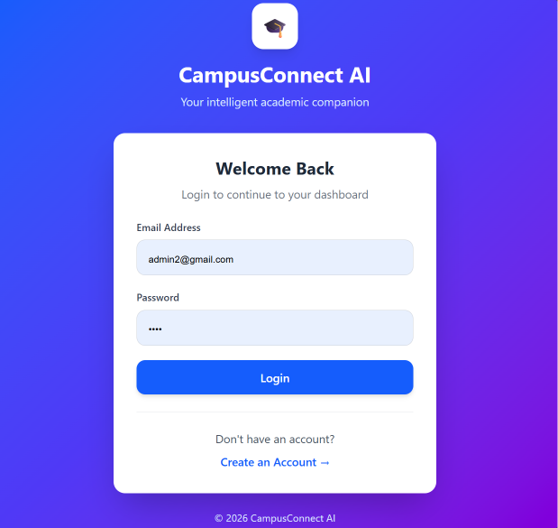
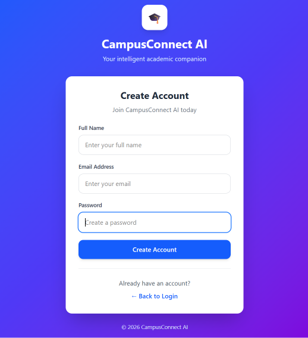
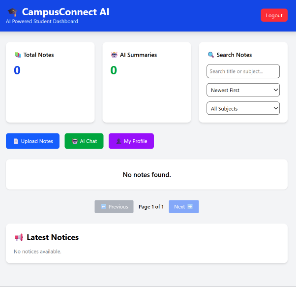
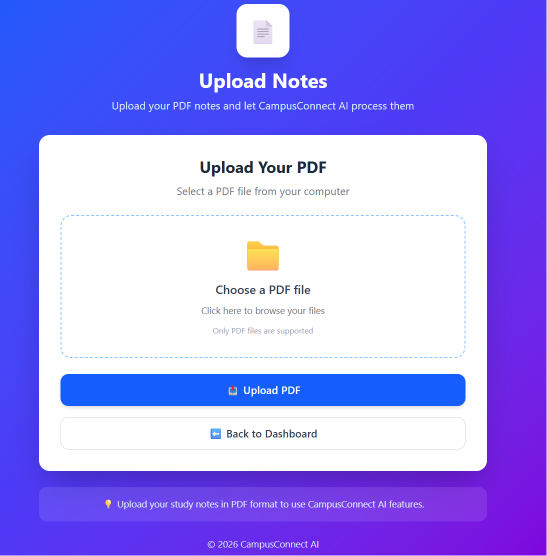
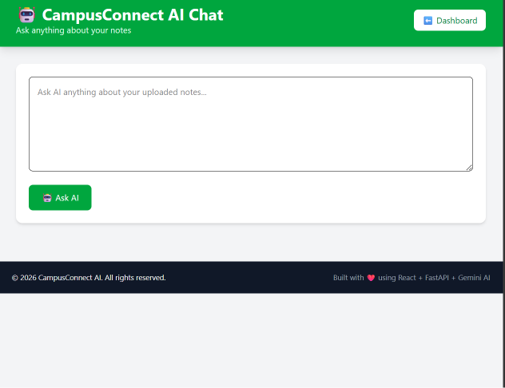
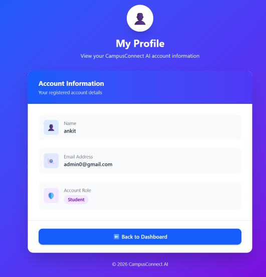

# 🚀 CampusConnect AI

> **An AI-powered college management and learning platform that brings notes, PDFs, AI assistance, notices, and academic management into one place.**

CampusConnect AI is a full-stack web application designed to help college students manage their academic resources more efficiently using **AI-powered PDF summarization and an intelligent chat assistant**.

The platform provides secure authentication, note management, PDF uploads, AI-generated summaries, AI chat, notices, dashboard analytics, and role-based administration.

---

## 🌐 Live Application

**Frontend:**
https://campusconnect-ai-plum.vercel.app

**Backend API:**
https://campusconnect-ai-backend-bfs9.onrender.com

**API Documentation:**
https://campusconnect-ai-backend-bfs9.onrender.com/docs

---

## ✨ Features

### 🔐 Authentication & Security

* User registration and login
* JWT-based authentication
* Protected routes
* Role-based access control
* User profile management

### 📚 Academic Notes Management

* Upload PDF study material
* Store and manage notes
* View uploaded documents
* Download/view PDFs
* Delete notes
* Search notes
* Filter and sort notes

### 🤖 AI Features

* AI-powered PDF summarization
* AI academic chat assistant
* Automatic generation of useful summaries from uploaded study material
* Gemini AI integration

### 📊 Dashboard

* Total notes count
* Summarized notes count
* Latest upload information
* Personalized user dashboard

### 📢 Notice Management

* College notices
* Notice creation and management
* Admin-controlled notices

### 👨‍💼 Admin Dashboard

* User management
* Notes management
* Statistics
* Notice management
* Role-based administrative access

---

## 🛠️ Tech Stack

### Frontend

* React.js
* Vite
* Axios
* React Router
* Tailwind CSS

### Backend

* Python
* FastAPI
* Uvicorn
* SQLAlchemy
* Pydantic

### Database

* SQLite

### Authentication

* JWT Authentication

### Artificial Intelligence

* Google Gemini AI

### PDF Processing

* PyMuPDF

### Deployment

* Vercel — Frontend
* Render — Backend

---

## 🏗️ System Architecture

```text
                    ┌─────────────────────┐
                    │      User           │
                    │  Web Browser        │
                    └──────────┬──────────┘
                               │
                               ▼
                    ┌─────────────────────┐
                    │  React + Vite       │
                    │     Frontend        │
                    │     Vercel          │
                    └──────────┬──────────┘
                               │
                         REST API / Axios
                               │
                               ▼
                    ┌─────────────────────┐
                    │      FastAPI        │
                    │      Backend        │
                    │      Render         │
                    └──────┬──────┬───────┘
                           │      │
                 ┌─────────┘      └──────────┐
                 ▼                           ▼
        ┌─────────────────┐        ┌─────────────────┐
        │ SQLite +        │        │ Google Gemini   │
        │ SQLAlchemy      │        │ AI              │
        └─────────────────┘        └─────────────────┘
```

---

## 🔄 How CampusConnect AI Works

### 1. User Authentication

The user registers or logs in through the React frontend.

```text
Register/Login
      ↓
FastAPI Authentication API
      ↓
JWT Token
      ↓
Authenticated User
```

### 2. PDF Upload

The user selects a PDF from the Upload Notes section.

```text
PDF
 ↓
React Frontend
 ↓
FastAPI /upload
 ↓
PDF Processing
 ↓
Text Extraction
 ↓
Gemini AI
 ↓
AI Summary
 ↓
Database
```

### 3. AI Chat

The user can interact with the AI assistant to ask academic questions and receive AI-generated responses.

---

## 📂 Project Structure

```text
campusconnect-ai/
│
├── ai/
│   └── summarizer.py
│
├── auth/
│   └── auth_handler.py
│
├── database/
│   ├── database.py
│   └── session.py
│
├── models/
│   ├── user.py
│   └── notes.py
│
├── routes/
│   ├── users.py
│   ├── notes.py
│   ├── upload.py
│   └── ...
│
├── utils/
│   └── pdf_reader.py
│
├── frontend/
│   ├── src/
│   ├── public/
│   ├── package.json
│   └── ...
│
├── main.py
├── requirements.txt
├── .gitignore
└── README.md
```

---

## ⚙️ Local Installation

### 1. Clone the repository

```bash
git clone https://github.com/shashanksingh09865-ai/campusconnect-ai.git
```

### 2. Open the project

```bash
cd campusconnect-ai
```

### 3. Create a virtual environment

```bash
python -m venv venv
```

### 4. Activate the virtual environment

Windows:

```bash
venv\Scripts\activate
```

### 5. Install backend dependencies

```bash
pip install -r requirements.txt
```

### 6. Configure environment variables

Create a `.env` file in the project root:

```env
GEMINI_API_KEY=your_gemini_api_key
```

Do not commit `.env` to GitHub.

### 7. Start the backend

```bash
python -m uvicorn main:app --reload
```

Backend:

```text
http://127.0.0.1:8000
```

Swagger API documentation:

```text
http://127.0.0.1:8000/docs
```

---

## 💻 Run the Frontend

Open another terminal:

```bash
cd frontend
```

Install dependencies:

```bash
npm install
```

Start the development server:

```bash
npm run dev
```

The frontend will normally be available at:

```text
http://localhost:5173
```

---

## 🔑 Environment Variables

The backend requires:

| Variable         | Description           |
| ---------------- | --------------------- |
| `GEMINI_API_KEY` | Google Gemini API key |

The frontend uses:

| Variable       | Description     |
| -------------- | --------------- |
| `VITE_API_URL` | Backend API URL |

---

## 🧪 Testing

CampusConnect AI was tested through both backend health checks and complete production end-to-end testing.

The production workflow tested includes:

```text
Registration
     ↓
Login
     ↓
Dashboard
     ↓
PDF Upload
     ↓
AI Summary
     ↓
PDF View/Download
     ↓
Notes Management
     ↓
AI Chat
     ↓
Search / Filter / Sort
     ↓
Profile
     ↓
Logout / Login
```

The deployed application successfully completed the production testing workflow.

---

## 🌍 Deployment

### Frontend

The React/Vite frontend is deployed using **Vercel**.

### Backend

The FastAPI backend is deployed using **Render**.

### Communication

```text
Vercel Frontend
      │
      │ HTTPS REST API
      ▼
Render FastAPI Backend
      │
      ├── SQLite / SQLAlchemy
      │
      └── Google Gemini AI
```

---

## 🔒 Security

The project includes:

* JWT authentication
* Protected API routes
* Role-based access control
* Environment variables for API secrets
* `.gitignore` protection for sensitive/local files
* User-specific note access

---

## 🔮 Future Scope

Possible future improvements include:

* PostgreSQL production database
* Persistent cloud file storage
* Real-time notifications
* College timetable management
* Assignment management
* Attendance tracking
* AI-powered personalized study plans
* AI quiz generation from PDFs
* Multi-language AI assistance
* Mobile application
* Email notifications

---

## 🎯 Project Objective

The primary objective of CampusConnect AI is to provide students with a centralized academic platform where they can:

* Manage their study material
* Upload and organize PDFs
* Quickly understand lengthy documents using AI summaries
* Ask academic questions through AI chat
* Access important college notices
* Monitor their academic resources through a personalized dashboard

---

## 👨‍💻 Developer

**Shashank Singh**

B.Tech Computer Science & Engineering

GitHub:
https://github.com/shashanksingh09865-ai

---

## ⭐ Support

If you find this project useful, consider giving the repository a ⭐ on GitHub.

---

## 📄 License

This project is developed for educational and portfolio purposes.

## 📸 Application Screenshots

### 🔐 Login


### 📝 Registration


### 📊 Student Dashboard


### 📄 Upload Notes


### 🤖 AI Chat


### 👤 User Profile

